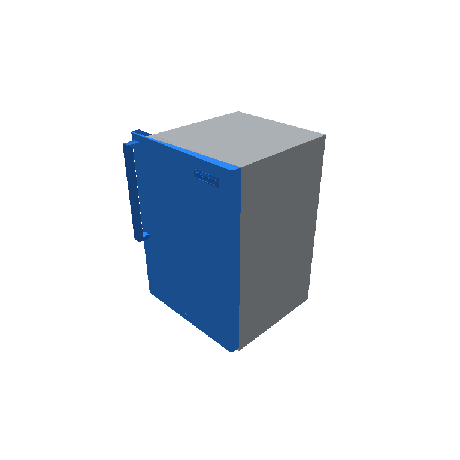
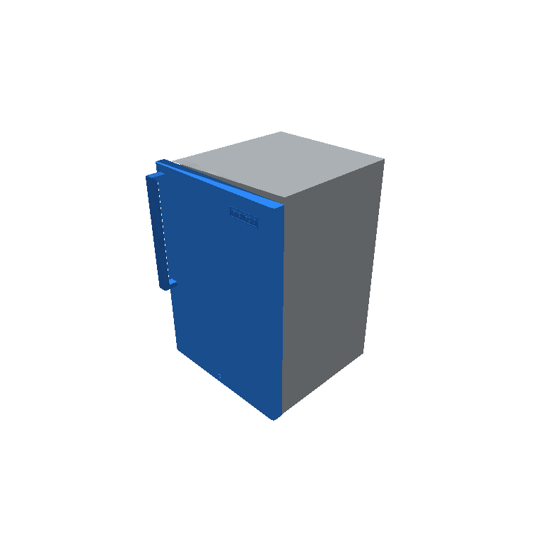
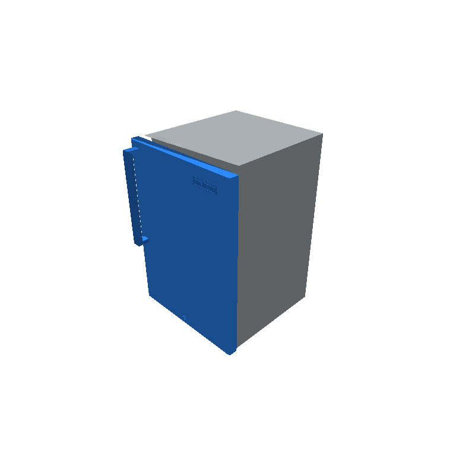
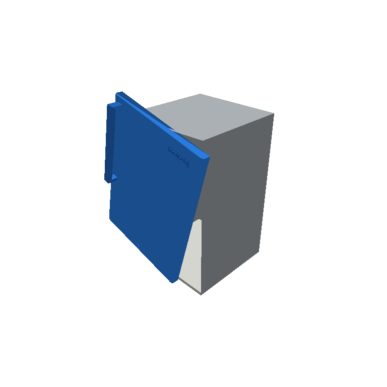
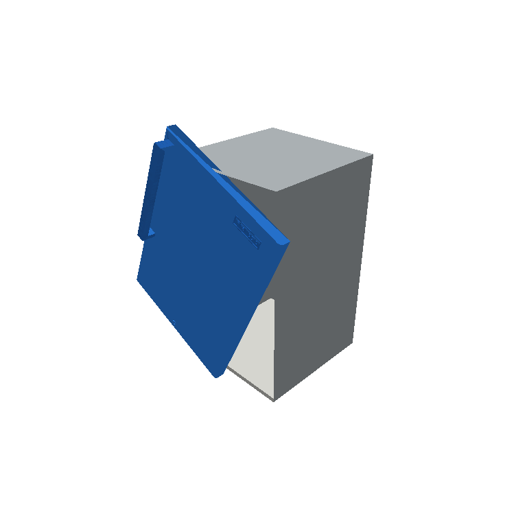
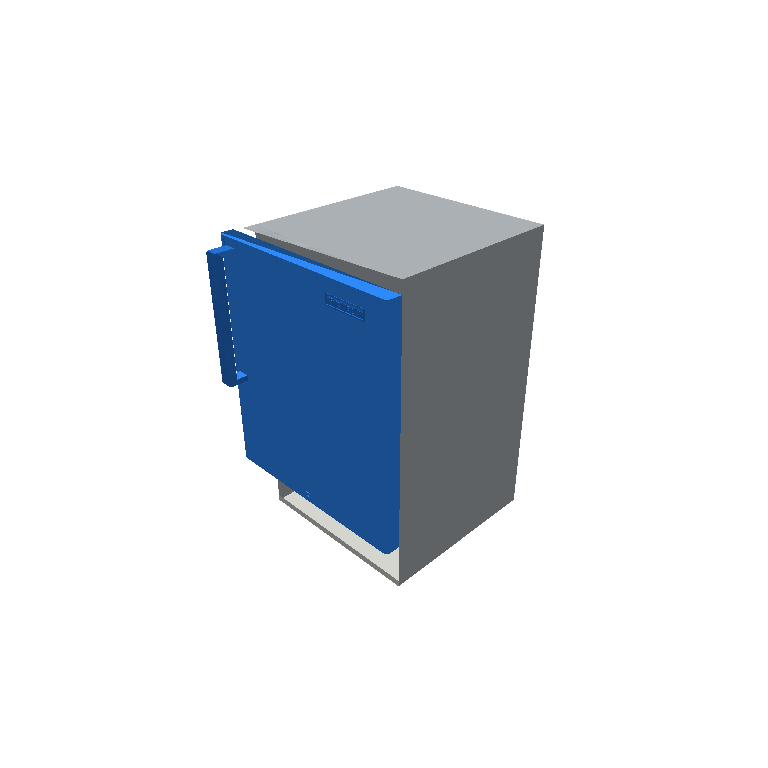
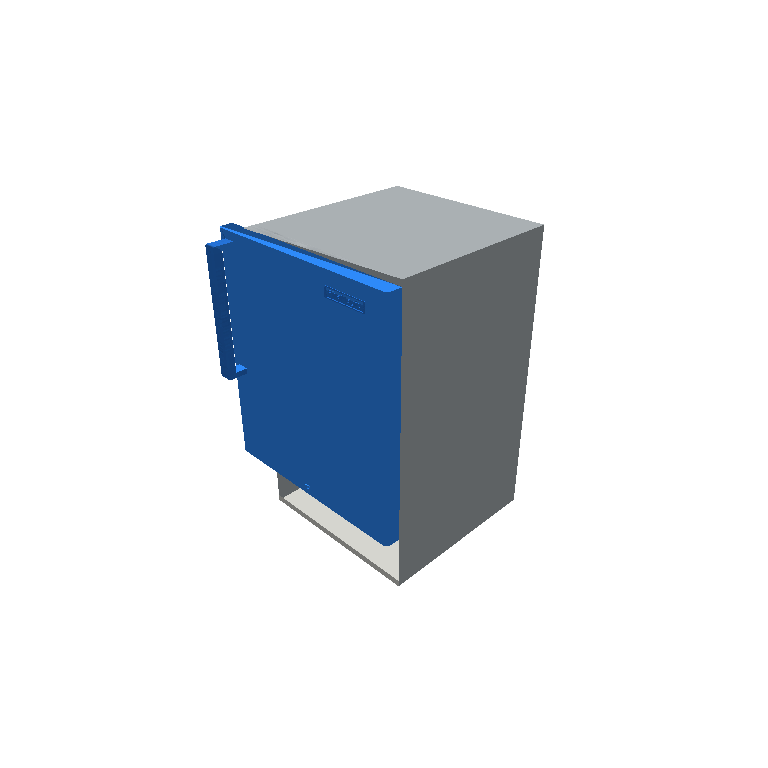
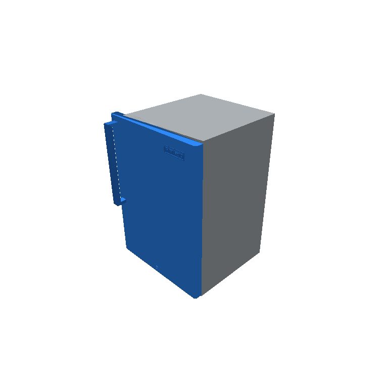
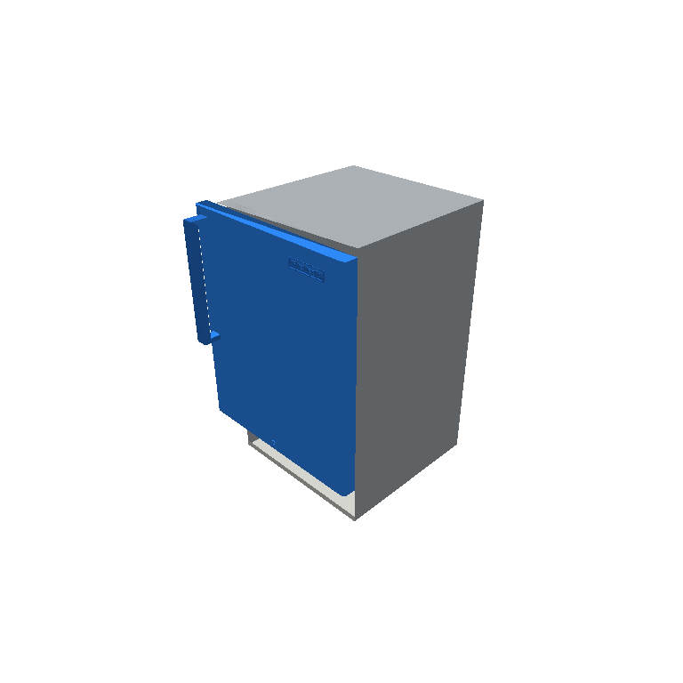

# 10797_ctrl_scale_0  (control_single)

- agent: `loop_qwen`  ·  contract: `batch`  ·  modality: `image`  ·  deviation: `False`
- faults (1): scale  on ['link_1']
- ground-truth fix sequence: SCALE(P1, X, 0.838192)
- **terminal: PASS=False  score=0.140  deviation=85.6 mm  simulates=10**

## turn 1  (SIMULATE)

- budget left: 10  ·  images sent: 2  ·  latency: 0.8s

**action** `TRANSLATE(P1, Y, -0.04000)`

- PASS=False  score=0.1949  deviation=71.1 mm

| part | deviation mm | within tol | closes |
|---|---|---|---|
| link_1 | 71.1 | False | True |

## turn 2  (SIMULATE)

- budget left: 9  ·  images sent: 2  ·  latency: 0.7s

**action** `TRANSLATE(P1, Y, -0.06000)`

- PASS=False  score=0.1395  deviation=85.6 mm

| part | deviation mm | within tol | closes |
|---|---|---|---|
| link_1 | 85.645 | False | True |

## turn 3  (SIMULATE)

- budget left: 8  ·  images sent: 2  ·  latency: 0.7s

**action** `ROTATE(P1, Z, -15.0000)`

- PASS=False  score=0.0722  deviation=114.2 mm

| part | deviation mm | within tol | closes |
|---|---|---|---|
| link_1 | 114.249 | False | True |

## turn 4  (SIMULATE)

- budget left: 7  ·  images sent: 2  ·  latency: 1.0s

**action** `[TRANSLATE(P1, Y, -0.08000); ROTATE(P1, Z, -25.0000)]`

- PASS=False  score=0.005  deviation=230.6 mm

| part | deviation mm | within tol | closes |
|---|---|---|---|
| link_1 | 230.58 | False | True |

## turn 5  (SIMULATE)

- budget left: 6  ·  images sent: 2  ·  latency: 1.0s

**action** `[TRANSLATE(P1, Y, -0.04000); SCALE(P1, Y, 0.850000)]`

- PASS=False  score=0.1664  deviation=78.0 mm

| part | deviation mm | within tol | closes |
|---|---|---|---|
| link_1 | 77.967 | False | True |

## turn 6  (SIMULATE)

- budget left: 5  ·  images sent: 2  ·  latency: 1.0s

**action** `[TRANSLATE(P1, Y, -0.06000); SCALE(P1, Y, 0.820000)]`

- PASS=False  score=0.1265  deviation=89.9 mm

| part | deviation mm | within tol | closes |
|---|---|---|---|
| link_1 | 89.886 | False | True |

## turn 7  (SIMULATE)

- budget left: 4  ·  images sent: 2  ·  latency: 0.9s

**action** `[TRANSLATE(P1, Y, -0.03000); SCALE(P1, Y, 0.810000)]`

- PASS=False  score=0.1471  deviation=83.3 mm

| part | deviation mm | within tol | closes |
|---|---|---|---|
| link_1 | 83.323 | False | True |

## turn 8  (SIMULATE)

- budget left: 3  ·  images sent: 2  ·  latency: 0.8s

**action** `TRANSLATE(P1, Y, -0.02000)`

- PASS=False  score=0.2538  deviation=59.6 mm

| part | deviation mm | within tol | closes |
|---|---|---|---|
| link_1 | 59.623 | False | True |

## turn 9  (SIMULATE)

- budget left: 2  ·  images sent: 2  ·  latency: 1.0s

**action** `[TRANSLATE(P1, Y, -0.04000); SCALE(P1, Y, 0.850000)]`

- PASS=False  score=0.1664  deviation=78.0 mm

| part | deviation mm | within tol | closes |
|---|---|---|---|
| link_1 | 77.967 | False | True |

## turn 10  (SIMULATE)

- budget left: 1  ·  images sent: 2  ·  latency: 0.7s

**action** `TRANSLATE(P1, Y, -0.06000)`

- PASS=False  score=0.1395  deviation=85.6 mm

| part | deviation mm | within tol | closes |
|---|---|---|---|
| link_1 | 85.645 | False | True |

## turn 11  (COMMIT)

- budget left: 0  ·  images sent: 2  ·  latency: 0.8s

**action** `TRANSLATE(P1, Y, -0.06000)`

- PASS=False  score=0.1395  deviation=85.6 mm

| part | deviation mm | within tol | closes |
|---|---|---|---|
| link_1 | 85.645 | False | True |

