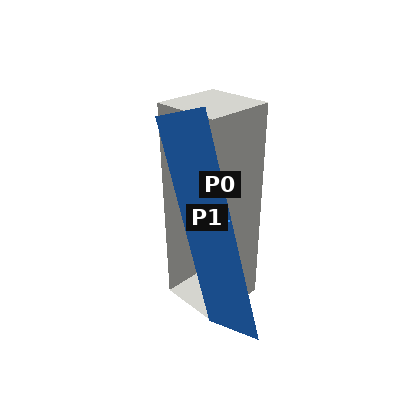
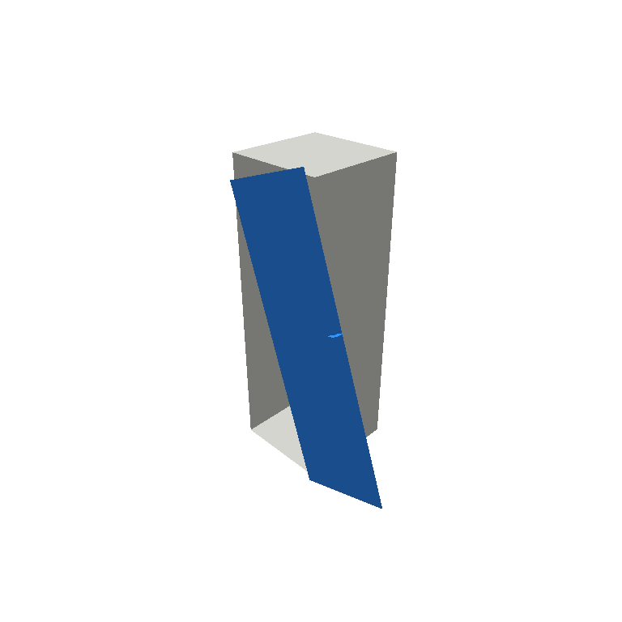
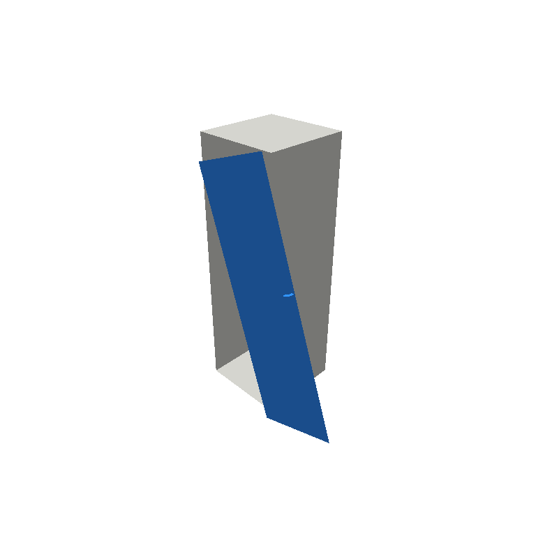
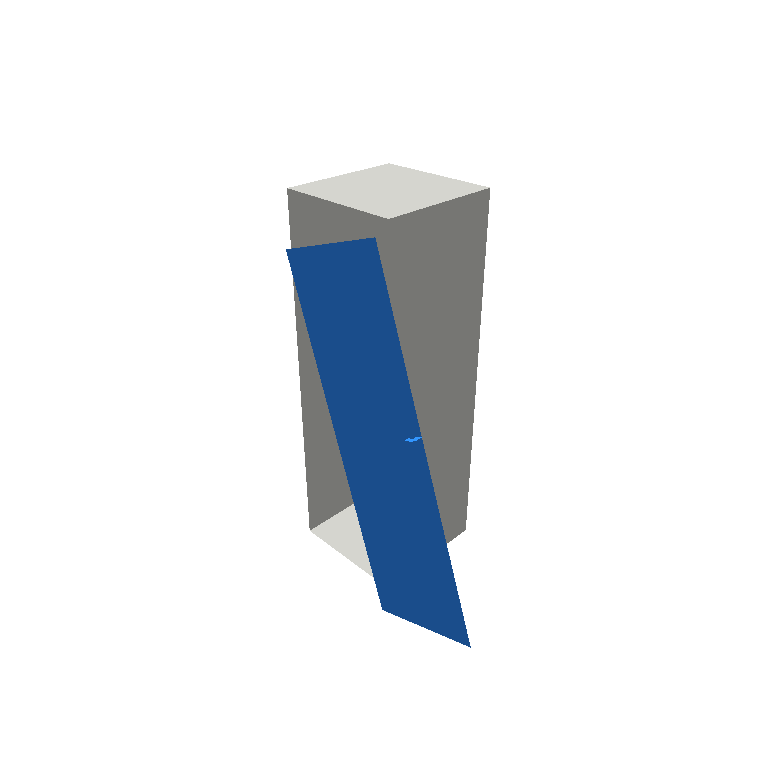
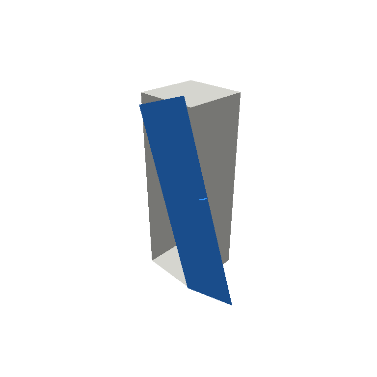
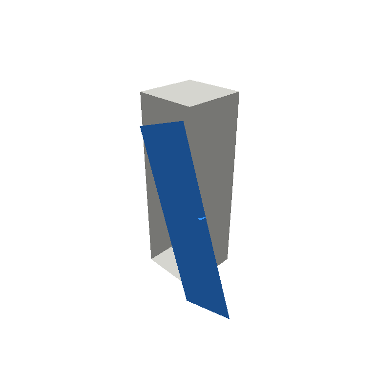
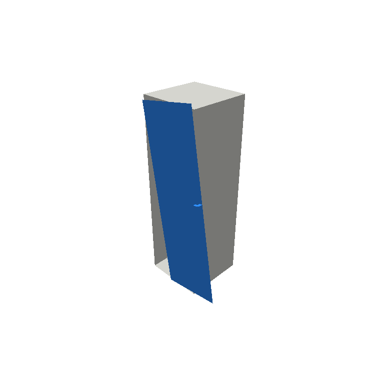

# 12042_ctrl_rotate_0  (control_single)

- agent: `loop_qwen`  ·  contract: `batch`  ·  modality: `image`  ·  deviation: `False`
- faults (1): rotate  on ['link_1']
- ground-truth fix sequence: ROTATE(P1, Z, -18.6877)
- **terminal: PASS=True  score=0.562  deviation=27.9 mm  simulates=6**

## turn 1  (SIMULATE)

- budget left: 10  ·  images sent: 2  ·  latency: 0.8s

**action** `TRANSLATE(P1, Y, -0.04000)`

- PASS=False  score=0.179  deviation=83.4 mm

| part | deviation mm | within tol | closes |
|---|---|---|---|
| link_1 | 83.368 | False | True |

## turn 2  (SIMULATE)

- budget left: 9  ·  images sent: 2  ·  latency: 0.7s

**action** `TRANSLATE(P1, Y, -0.08000)`

- PASS=False  score=0.0936  deviation=114.8 mm

| part | deviation mm | within tol | closes |
|---|---|---|---|
| link_1 | 114.778 | False | True |

## turn 3  (SIMULATE)

- budget left: 8  ·  images sent: 2  ·  latency: 0.7s

**action** `TRANSLATE(P1, Y, -0.12000)`

- PASS=False  score=0.0466  deviation=148.6 mm

| part | deviation mm | within tol | closes |
|---|---|---|---|
| link_1 | 148.552 | False | True |

## turn 4  (SIMULATE)

- budget left: 7  ·  images sent: 2  ·  latency: 0.7s

**action** `TRANSLATE(P1, Y, -0.16000)`

- PASS=False  score=0.0226  deviation=183.7 mm

| part | deviation mm | within tol | closes |
|---|---|---|---|
| link_1 | 183.732 | False | True |

## turn 5  (SIMULATE)

- budget left: 6  ·  images sent: 2  ·  latency: 0.7s

**action** `TRANSLATE(P1, Y, -0.20000)`

- PASS=False  score=0.0107  deviation=220.0 mm

| part | deviation mm | within tol | closes |
|---|---|---|---|
| link_1 | 219.967 | False | True |

## turn 6  (SIMULATE)

- budget left: 5  ·  images sent: 2  ·  latency: 0.7s

**action** `ROTATE(P1, Z, -10.0000)`

- PASS=True  score=0.5625  deviation=27.9 mm

| part | deviation mm | within tol | closes |
|---|---|---|---|
| link_1 | 27.878 | True | True |

## turn 7  (COMMIT)

- budget left: 4  ·  images sent: 2  ·  latency: 0.7s

**action** `ROTATE(P1, Z, -10.0000)`

- PASS=True  score=0.5625  deviation=27.9 mm

| part | deviation mm | within tol | closes |
|---|---|---|---|
| link_1 | 27.878 | True | True |

